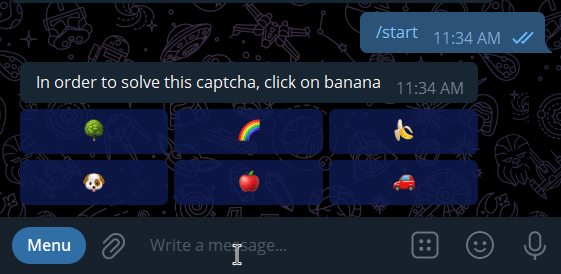

# Captcha via inline keyboard for aiogram

## Looks like


``` python
from captcha import Captcha

@dp.message_handler(commands=["start", "help"])
async def info(message: types.Message):
    if message.from_user.id not in Captcha.passed_captcha_users:
        captcha = Captcha()
        captcha.register_handlers(dp)
        
        await bot.send_message(
            message.chat.id,
            captcha.get_caption(),
            reply_markup=captcha.get_captcha_keyboard()
        )
        return
    
    # Other code
    ...
```


## Usage
``` python
from captcha import Captcha


# You may define your own choices, which will be used in keyboard initialization
my_choices: Dict[str, str] = {
    "cat": "🐈",
    "human": "👨",
    "banana": "🍌",
    "monkey": "🐒",
}

# The module collects information about which users have passed the captcha. 
# This is necessary so that the captcha does not appear several times in a row
if message.from_user.id not in Captcha.captcha_passed_users:
    captcha = Captcha(
        choices=my_choices  
        # You can also don't choose to specify your own choices. 
        # In this case, the module's built-in choices will be used
    )
    keyboard = captcha.get_captcha_keyboard()
    captcha.register_handlers(dp)  # dp -> your dispatcher instance

    await bot.send_message(
        message.chat.id,
        captcha.get_caption(),  # This is necessary in order for the captcha description
        #                         to be generated automatically, since it is dynamic
        reply_markup=keyboard
    )
    return
```


## Contributors
* [**mrSkyGuy**](https://github.com/mrskyguy)
